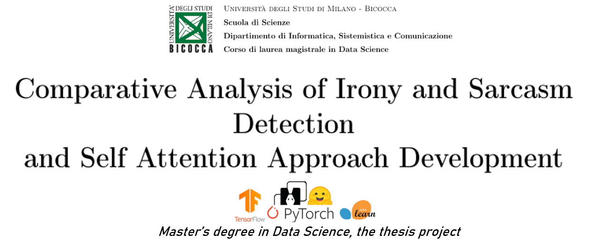

## Abstract
<html>
<body>
 <h1 style="text-align:right;">***The detection of irony and sarcasm is one of the most insidious challenges in the field of Natural Language Processing. Over the years, several techniques have been studied to analyze these rhetorical figures, trying to identify the elements that discriminate, in a significant way, what is sarcastic or ironic from what is not. Within this study, some models that are state of the art are analyzed. As far as Machine Learning is concerned, the most discriminating features such as part of speech, pragmatic particles and sentiment are studied. Subsequently, these models are optimized, comparing Bayesian optimization techniques and random search. Once, the best hyperparameters are identified, ensemble methods such as Bayesian Model Averaging (BMA) are exploited. In relation to Deep Learning, two main models are analyzed: DeepMoji, developed by MIT, and a model called Transformer Based, which exploits the generalization power of Roberta Transformer. As soon as these models are compared, the main goal is to identify a new system able to better capture the two rhetorical figures. To this end, two models composed of attention mechanisms are proposed, exploiting the principle of Transfer Learning, using Bert Tweet Model and DeepMoji Model as feature extractors. After identifying the various architectures, an ensemble method is applied on the set of approaches proposed, in order to identify the best combination of algorithms that can achieve satisfactory results. Frameworks used: Pytorch, TF 2.0, Scikit Learn, Scikit-Optimize, Transformers***</h1>
</body>
</html>
