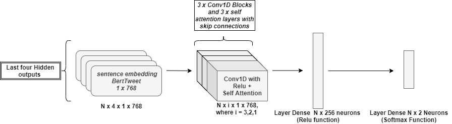
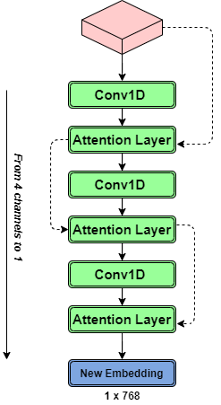
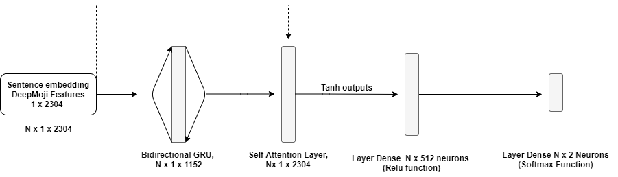
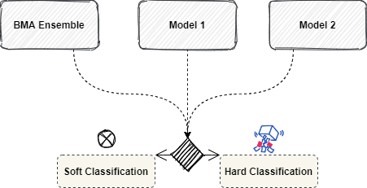

## Abstract

The detection of irony and sarcasm is one of the most insidious challenges in the field of Natural Language Processing. Over the years, several techniques have been studied to analyze these rhetorical figures, trying to identify the elements that discriminate, in a significant way, what is sarcastic or ironic from what is not. Within this study, some models that are state of the art are analyzed. As far as Machine Learning is concerned, the most discriminating features such as part of speech, pragmatic particles and sentiment are studied. Subsequently, these models are optimized, comparing Bayesian optimization techniques and random search. Once, the best hyperparameters are identified, ensemble methods such as Bayesian Model Averaging (BMA) are exploited. In relation to Deep Learning, two main models are analyzed: DeepMoji, developed by MIT, and a model called Transformer Based, which exploits the generalization power of Roberta Transformer. As soon as these models are compared, the main goal is to identify a new system able to better capture the two rhetorical figures. To this end, two models composed of attention mechanisms are proposed, exploiting the principle of Transfer Learning, using Bert Tweet Model and DeepMoji Model as feature extractors. After identifying the various architectures, an ensemble method is applied on the set of approaches proposed, in order to identify the best combination of algorithms that can achieve satisfactory results. The development of all models is based on the following objectives: how well the models are able to generalise over out-domain datasets and which models are able to identify the right patterns to achieve better performance. 

  
 ### Frameworks for ML and DL models:
 - Pytorch 
 - Transformers
 - TF 2.0 
 - Scikit-Learn 
 - Scikit-Optimize 
 
### Literature of implemented models: 
- RCCN-Roberta: A Transformer-based approach to Irony and Sarcasm detection, https://arxiv.org/pdf/1911.10401.pdf
- DeepMoji: Using millions of emoji occurrences to learn any-domain representations for detecting sentiment, emotion and sarcasm, https://arxiv.org/abs/1708.00524
- Bayesian Model Averaging: Detecting Irony and Sarcasm in Microblogs: The Role of Expressive Signals and Ensemble Classifiers, https://boa.unimib.it/handle/10281/135766

### New Proposed Methods: 
- **BERTweet Features-based**, a new way to combine embeddings from output encoder layers with self attention layers 

  

where the combining block is the following: 

  

- **DeepMoji Features-based**, a new architecture based on self attention layer and Bidirectional GRU

  

- **Ensemble of Ensembles**, merging the previous models with BMA ensemble method

  

## Working Directory Set Up

- **Folder src** contains all the available scripts of this project. Each folder within SRC is divided based on the different working phase. 

- **Folder img** contains all the images and plots created in this project

## Data
Data are collected using the various ids provided by the authors of different papers, however due to Twitter restrictions training and test data cannot be shared

